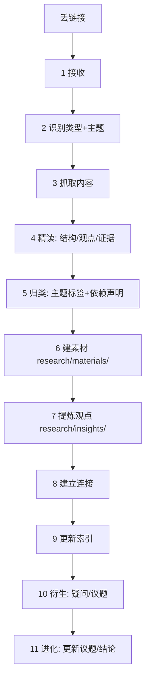

# 收录工作流 · Workflow

从"一条链接"到"一次理解进化"的完整流程。

## 各步说明

1. **接收**：四类输入——① 链接（对话或 `inbox/links.md`）② 本机文件绝对路径 ③ 投递区文件（`inbox/raw/`）④ 粘贴文本。详见 [`tools.md`](tools.md)「输入来源」。
2. **识别**：判断类型（文章/论文/视频/书籍/代码/播客）+ 主题标签（tcm/tech/philosophy/dao/music/meta，可多主题）。
3. **抓取/读取**：链接 → 按 [`tools.md`](tools.md) 选抓取工具；本机/投递区文件 → 直接读（长 PDF 走 `deepread` path）；粘贴文本 → 直接处理。重要原文/长文存 `research/materials/raw/` 留档，素材 `raw:` 记录。
4. **精读**：提取论证结构、核心观点、关键证据、出处（`deepread`）。
5. **归类**：定主题标签、打标签（tags 可跨主题）、定 `depends:` 依赖声明（independent/intra/external:）。
6. **建素材**：按 [`templates/material.md`](templates/material.md) 填入 `research/materials/YYYYMMDD-slug.md`。
7. **提炼观点**：把可复用的原子主张写成观点 `research/insights/cNNNN-slug.md`（默认 `depends: intra`）。
8. **建立连接**：素材 ↔ 观点 ↔ 议题 ↔ 其他素材，互加链接。
9. **更新索引**：更新 `INDEX.md` + `research/materials/README.md` 的表格。**同步写回规则**：后续任何变更（提炼观点、建立议题、写结论）必须同步更新 INDEX 对应行（状态/观点/议题列），同一 commit 落地；状态达标才可晋升（见下文「状态生命周期与晋升判据」）。
10. **衍生**：把疑问/想法记入 `research/issues/`（新建或更新议题）。**触发阈值**：≥2 个素材触及同一问题 → 必须建立议题；提炼观点时若该观点能喂养某个已有/新问题，必须链接到对应议题。
11. **进化**：若新内容改变了某条议题的理解，更新该议题并记入历史；必要时催生结论。

## 原则

- **客观与主观分离**：素材里"它说了什么"和"我怎么想"分开放。
- **原子化**：观点尽量一条一个主张，方便复用与链接。
- **可追溯**：每个观点尽量能回到出处（引用 + 定位）。
- **演化留痕**：议题带历史，git 记录每次改动。
- **不过度**：先建素材，观点/议题/结论按需生长，不强行凑数。

## 状态生命周期与晋升判据

| 状态 | 含义 | 晋升判据（可检查） |
|------|------|-------------------|
| collected | 素材已建 | front matter 完整、`raw:` 路径存在、`depends:` 声明 |
| read | 已精读 | 核心观点 + 证据节填写完毕 |
| digested | 提炼成观点 | ≥1 个观点，且该观点 `source:` 回链本素材 |
| threaded | 喂养议题 | ≥1 条议题的"关键支撑"回链本素材 |
| synthesized | 融入结论 | 内容已融入 `research/conclusions/` ≥1 篇结论 |

- 状态只升不降（降级需人决定 + 记入变更历史）；
- 晋升必须与 INDEX 对应行更新同步（同一 commit）——这条规则堵"提了观点没改状态"的漏；
- 任何触及索引/状态/链接的更新后，跑 `python3 governance/check-consistency.py` 全局检查，结果随汇报给出。

## 全局一致性检查

每次相关变更后运行 `python3 governance/check-consistency.py`（exit 0 = 通过；借鉴 dba 项目 `learn/_audit` 的机器校验模式）。11 项检查：
1. INDEX 素材行 ↔ `research/materials/` 实际文件（双向计数 + 路径存在）
2. materials/README 索引表行数 ↔ materials/ 文件数
3. 观点列三方一致：INDEX 观点列 ↔ 素材 `related:` ↔ 观点 `source:`
4. 议题引用可达 + INDEX 议题表 ↔ `research/issues/`
5. 所有 `raw:` 路径存在
6. 状态健全性：有观点的素材状态必须 ≥ digested
7. PROJECTS 注册表 ↔ projects/ 目录（双向）+ 项目 README 必存 + done⇒回写结论链接
8. 全部相对链接可达（无断链；含 front matter raw: 路径）
9. 孤儿文件检查（可链接/可索引闭环）
10. 依赖声明校验（independent/intra/external:，矛盾即报错）
11. 旧命名漂移提示（条目/卡片/线索/综合 → 素材/观点/议题/结论，warning 不阻断）